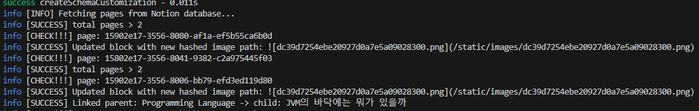
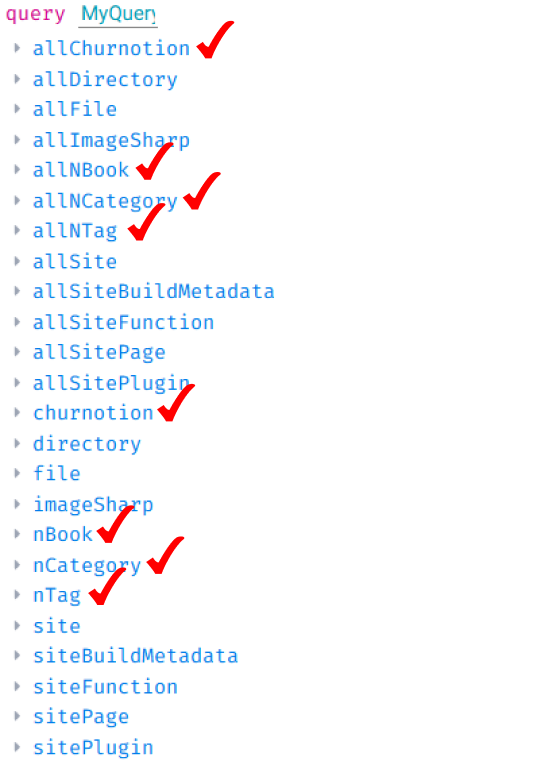

# gatsby-source-notion-churnotion

Gatsby plugin to connect with a Notion database recursively using the official API.

This plugin recursively collects categories from a single Notion database, which can be used as a CMS for your blog. It ultimately creates a Churnotion node that converts the components of a Notion page into MDX components and stores them in JSON format.

If you're considering Notion as your CMS for Gatsby, this plugin could be a great choice as it supports recursive category collection.

## What's New in v1.1.35

- **Major Overhaul of Node Relationship Handling**:
  - Completely rewrote the Book-Post relationship mechanism
  - Added custom GraphQL resolver for childrenChurnotion field
  - Improved recursive database traversal logic
  - Optimized batch processing with smaller batches (20 pages at a time)
  - Added detailed logging for better debuggability
  - Simplified code structure with direct database page processing

## What's New in v1.1.34

- **Fixed GraphQL Query Error**:
  - Fixed "Cannot return null for non-nullable field Churnotion.rawText" error
  - Changed rawText field to be nullable in schema definition
  - Added fallback empty string for rawText in Post node creation
  - Improved error handling for description field

## What's New in v1.1.33

- **Fixed childrenChurnotion Field Issues**:
  - Completely redesigned how Book-Post relationships are handled
  - Added explicit node fields for childrenChurnotion
  - Implemented robust node relationship creation in onPostBootstrap
  - Fixed schema definition by using Fields type
  - Resolved persistent "Field childrenChurnotion is not defined" error

## What's New in v1.1.32

- **Fixed Gatsby Schema Relationship Bug**:
  - Fixed `childrenChurnotion` field relationship in NBook nodes
  - Properly defined relationship between Book and Post nodes
  - Fixed "Field 'childrenChurnotion' is not defined" error during Gatsby build

## What's New in v1.1.31

- **Fixed ES Module compatibility issues**:
  - Removed dependency on external p-limit library
  - Implemented custom parallel processing queue
  - Fixed Gatsby build errors related to ESM imports
  - Improved CommonJS compatibility

## What's New in v1.1.30

- **Added support for more Notion block types**: 
  - bookmark, breadcrumb, callout, code, column, column_list, divider, embed, equation, file, link_preview, pdf, table, table_of_contents, toggle, to_do, video, audio
- **Improved performance**:
  - Added parallel processing for Notion API requests with concurrency limits
  - Implemented caching to reduce duplicate API calls
  - Added batch processing for large datasets
  - Added timeout handling for long-running operations
- **Code refactoring**:
  - Modular block processor architecture
  - Better error handling
  - Improved type safety

## Install

```shell
npm install gatsby-source-notion-churnotion
```

```shell
yarn add gatsby-source-notion-churnotion
```

## How to use
You need to set the following environment variables:

GATSBY_INTEGRATION_TOKEN
GATSBY_DATABASE_ID
To get the integration token, set it up in your Notion database, and find the database ID, refer to the official [Notion Integration Guide](https://developers.notion.com/docs/create-a-notion-integration).
### 환경변수 설정
```.env:title=.env
GATSBY_INTEGRATION_TOKEN={Your Notion API Integration Token}
GATSBY_DATABASE_ID={Your Notion Database ID}
```

### gatsby-config.ts / gatsby-config.js 추가

```ts:title=gatsby-config.ts
const config: GatsbyConfig = {
  plugins: [
    {
      resolve: `gatsby-source-notion-churnotion`,
      options: {
        token: process.env.GATSBY_INTEGRATION_TOKEN,
        databaseId: process.env.GATSBY_DATABASE_ID,
      },
    },
  ],
};
```

### Run Development Server
```shell
npm run develop
```

```shell
yarn develop
```

```shell
gatsby develop
```

When the development server is running, `gatsby-source-notion-churnotion` will fetch categories and pages from your Notion database using the official Notion API.




### Explore in GraphQL

Once the data is fetched, go to http://localhost:8000/__graphql, where you'll find new nodes such as `Churnotion`, `NBook`, `NCategory`, and `NTag` as shown below:



### Example Query

Use the following GraphQL query to explore the `Churnotion` node:

```gql
query MyQuery {
  allChurnotion {
    nodes {
      id
      content
    }
  }
}
```