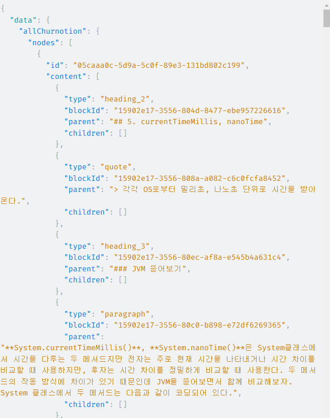

# gatsby-source-notion-churnotion

Gatsby plugin to connect with a Notion database recursively using the official API.

This plugin recursively collects categories from a single Notion database, which can be used as a CMS for your blog. It ultimately creates a Churnotion node that converts the components of a Notion page into MDX components and stores them in JSON format.

If you're considering Notion as your CMS for Gatsby, this plugin could be a great choice as it supports recursive category collection.

## Install

```shell
npm install gatsby-source-notion-churnotion
```

```shell
yarn add gatsby-source-notion-churnotion
```

## How to use
You need to set the following environment variables:

GATSBY_INTEGRATION_TOKEN
GATSBY_DATABASE_ID
To get the integration token, set it up in your Notion database, and find the database ID, refer to the official [Notion Integration Guide](https://developers.notion.com/docs/create-a-notion-integration).
### 환경변수 설정
```.env:title=.env
GATSBY_INTEGRATION_TOKEN={Your Notion API Integration Token}
GATSBY_DATABASE_ID={Your Notion Database ID}
```

### gatsby-config.ts / gatsby-config.js 추가

```ts:title=gatsby-config.ts
const config: GatsbyConfig = {
  plugins: [
    {
      resolve: `gatsby-source-notion-churnotion`,
      options: {
        token: process.env.GATSBY_INTEGRATION_TOKEN,
        databaseId: process.env.GATSBY_DATABASE_ID,
      },
    },
  ],
};
```

### Run Development Server
```shell
npm run develop
```

```shell
yarn develop
```

```shell
gatsby develop
```

When the development server is running, `gatsby-source-notion-churnotion` will fetch categories and pages from your Notion database using the official Notion API.


### Explore in GraphQL

Once the data is fetched, go to http://localhost:8000/__graphql, where you’ll find new nodes such as `Churnotion`, `NBook`, `NCategory`, and `NTag` as shown below:


### Example Query

Use the following GraphQL query to explore the `Churnotion` node:

```gql
query MyQuery {
  allChurnotion {
    nodes {
      id
      content
    }
  }
}
```

This will return results in MDX format, as shown below:



